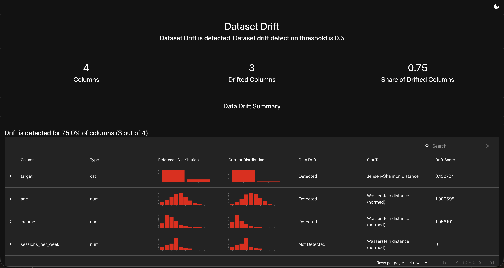

# Model Monitoring & Automated Retraining

Detects data drift and performance decay on a deployed model using Evidently, generates HTML drift reports, and triggers retraining when thresholds are breached.

## Flow
```
reference data ──┐
                 ├─ monitor.py ─→ drift report (HTML) ─→ threshold breached? ─→ retrain.py ─→ new model + versioned artifact
production data ─┘
```

## Quickstart
```bash
pip install -r requirements.txt
python simulate.py      # creates reference + "drifted" production batches
python monitor.py       # writes reports/drift_report.html, exits 1 if drift
python monitor.py && echo "healthy" || python retrain.py
```
Schedule with cron: `0 6 * * * cd /path && python monitor.py || python retrain.py`

## Results



- 3 of 4 columns drifted (75%), far above the 30% threshold: `age` and
  `income` were deliberately shifted in the simulator, and `target`
  drifted as a consequence — label drift riding along with feature
  drift, since the label depends on age.
- `monitor.py` exited non-zero, triggering `retrain.py`, which saved a
  timestamped model artifact (`models/model-20260716-160036.joblib`).
- Retrained ROC-AUC is 1.0000 — expected here, not leakage: the synthetic
  target is a deterministic function of the features, so it is exactly
  learnable. Real-world labels contain noise; a production version of
  this pipeline would compare the new model's AUC against the previous
  version's before promoting it.

## Note on dependencies

Evidently ≥0.5 redesigned its API (`metric_preset` was removed), so this
project pins `evidently==0.4.40`.

- Note: the report banner's "threshold 0.5" is Evidently's internal
  dataset-drift default (50% of columns); this pipeline enforces a
  stricter 30% retraining trigger in monitor.py.
